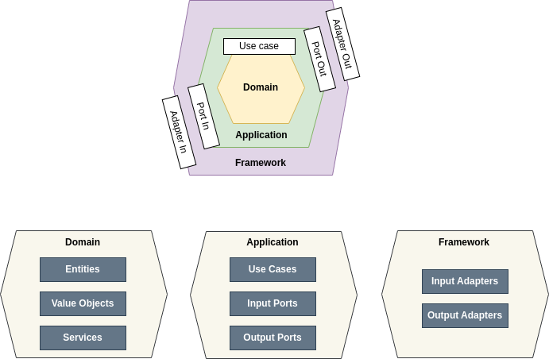
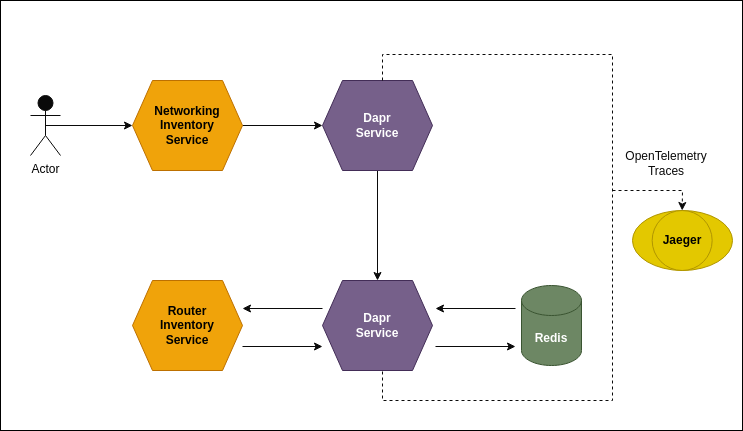

# quarkus-dapr-hexagonal-architecture

## Hexagonal Architecture

## Diagram

## Quarkus

Step 1: Compile Router Inventory Service 

Run these command: 
    cd router-inventory-service
    mvn clean
    quarkus build

Step 2: Compile Networking Inventory Service 

Run these command: 
    cd networking-inventory-service
    mvn clean
    quarkus build

## Dapr

Step 1: Install Dapr CLI 

Follow the instructions at https://docs.dapr.io/getting-started/installing-dapr-cli/.

Step 2: Run Dapr

Run this command: dapr run -f dapr/

## Notes

1. Use a DAPR framework for invoking DAPR services. You shouldn't invoke DAPR services using 
 HTTP requests.
2. If you invoke DAPR's services using HTTP requests, don't forget to add headers 
defined by the W3C specification in your invocation chains.
3. Define scopes for a group of related services. For example, define a scope between
a service and its DAPR data store. 
4. Add a configuration resource (yaml file) with an endpoint address to a distributed
 tracing system (Zipkin or Jaeger or others), and also include a sampling rate.
5. Add code to a readiness method that checks the status of the sidecar, and also include 
code for checking the status of a service that your service depends on. For example, a 
database service.
